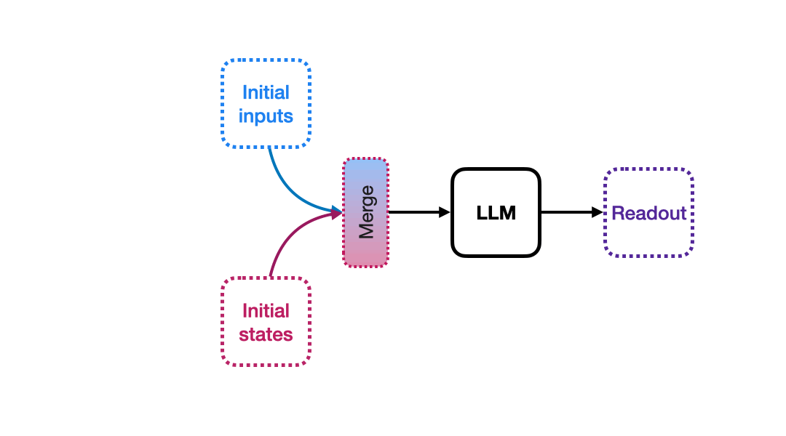
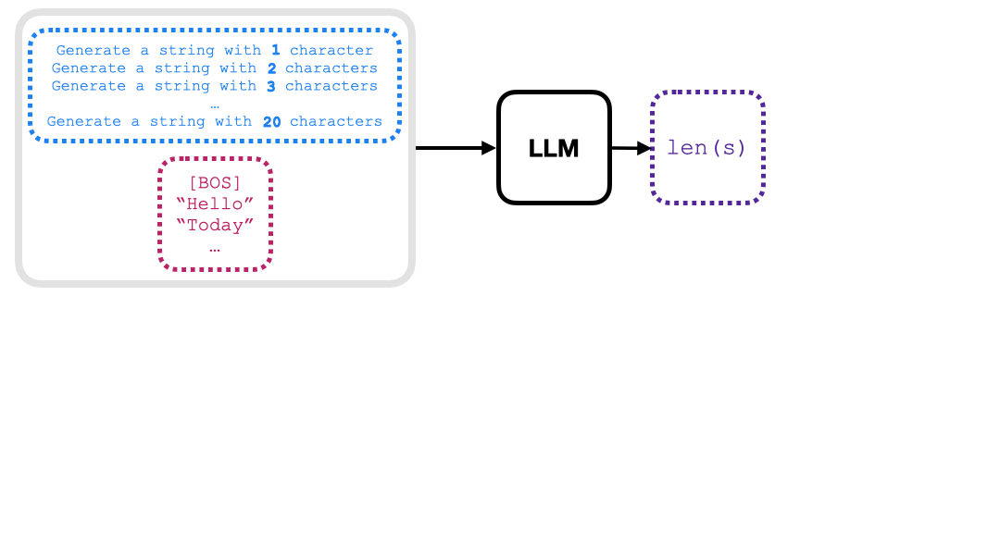
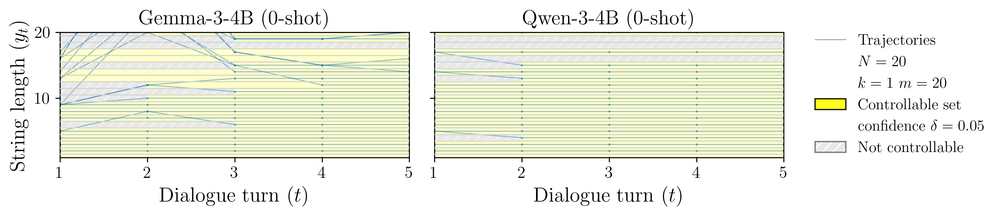
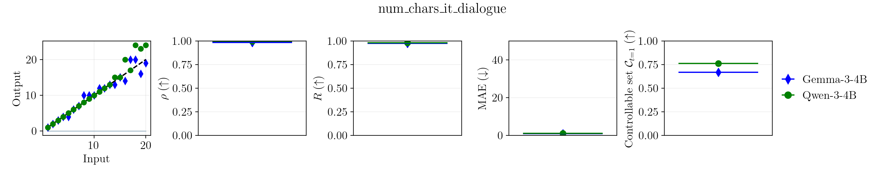

# GenCtrl — A Formal Controllability Toolkit for Generative Models


[](https://github.com/astral-sh/ruff)
[](https://github.com/astral-sh/uv)

This software project accompanies the research paper:

> ### [GenCtrl -- A Formal Controllability Toolkit for Generative Models.](https://arxiv.org/abs/2601.05637)  [[Bibtex](#-citation)]
>
> Emily Cheng*, Carmen Amo Alonso, Federico Danieli, Arno Blaas, Luca Zappella, Pau Rodriguez and Xavier Suau.

---

## 🎯 What is GenCtrl?

GenCtrl is a research toolkit that provides a **formal framework for measuring and understanding the controllability of generative AI models**. It helps answer critical questions like:

- 🤔 Can I reliably make an LLM generate text with specific properties (length, formality, structure)?
- 🎨 Can I control what appears in AI-generated images (number of objects, positioning, saturation)?
- 📊 How controllable is Model A compared to Model B?

### Key Features

- **🔒 Formal Guarantees**: Provides probably-approximately correct (PAC) bounds for controllable set estimates.
- **📦 Generic Approach**: Works with any generative model—LLMs, text-to-image models, or custom systems.
- **🎲 Distribution-Free**: Makes minimal assumptions (only requires bounded outputs).
- **🔧 Extensible**: Easy to implement custom controllability tests for your specific needs.

---

## 🧠 How It Works

GenCtrl frames human-model interaction as a **control process**. Given an initial state (e.g., a prompt) and a space of possible inputs (e.g., modifications to the prompt), the toolkit estimates which target outputs are achievable with formal probabilistic guarantees.

### The Controllability Question

Traditional approaches ask: *"Can this model do X?"*
GenCtrl asks: *"Under what conditions can this model reliably do X, and with what probability?"*

---

## 🚀 Quick Start

### Prerequisites

- Python 3.11
- [uv](https://docs.astral.sh/uv/) package manager

### Installation

1. **Clone the repository:**
   ```bash
   git clone https://github.com/apple/ml-genctrl
   cd ml-genctrl
   ```

2. **Install uv:**
   ```bash
   curl -LsSf https://astral.sh/uv/install.sh | sh
   export PATH="$HOME/.local/bin:$HOME/.cargo/bin:$PATH"
   source ~/.bashrc
   ```

3. **Set up the environment:**
   ```bash
   uv sync
   source .venv/bin/activate
   # Optional: Add your Hugging Face token for gated models
   export HF_TOKEN=<your_huggingface_token>
   ```

### Run Your First Experiment

Test whether an LLM can generate text with a specific number of characters:

```bash
python -m scripts.run --config-name llm_num_chars output_dir=/tmp output_file=myexperiment.json time_steps=5
```

This will create a results file at `/tmp/myexperiment.json` with controllability metrics and estimates.

---

## 🧪 Built-in Experiments

GenCtrl includes pre-configured controllability tests for common scenarios:

### 📝 Large Language Models (LLMs)

| Test | Config File | Description                                         |
|------|-------------|-----------------------------------------------------|
| **Character Count** | [llm_num_chars.yaml](configs/llm_num_chars.yaml) | Generate text with a specific number of characters. |
| **Even/Odd Length** | [llm_even_odd.yaml](configs/llm_even_odd.yaml) | Control whether output has even or odd length.      |
| **Average Word Length** | [llm_avg_word_length.yaml](configs/llm_avg_word_length.yaml) | Generate text with specific average word length.    |
| **Formality** | [llm_formality.yaml](configs/llm_formality.yaml) | Control the formality level of generated text.      |

**Example:**
```bash
python -m scripts.run --config-name llm_formality output_dir=/tmp output_file=formality_test.json time_steps=5
```

You can override config parameters directly from the command line:
```bash
python -m scripts.run --config-name llm_num_chars model_name=google/gemma-3-4b-it time_steps=5
```

### 🎨 Text-to-Image (T2I) Models

| Test | Config File | Description                                        |
|------|-------------|----------------------------------------------------|
| **Object Count** | [t2i_num_objects.yaml](configs/t2i_num_objects.yaml) | Control the number of objects in generated images. |
| **Object Position** | [t2i_pos_objects.yaml](configs/t2i_pos_objects.yaml) | Control where objects appear in images.            |
| **Saturation** | [t2i_saturation.yaml](configs/t2i_saturation.yaml) | Control the color saturation of images.            |

**Example:**
```bash
python -m scripts.run --config-name t2i_num_objects time_steps=1  # Always use time_steps=1 for T2I
```

---

## 🛠️ Building Custom Controllability Tests

GenCtrl uses a **`Task`** class as the main abstraction for defining controllability tests. Creating your own test involves subclassing `Task` and implementing its required methods:



### Creating a Custom Task

To create a new controllability test, you need to:

1. **Create a Task subclass** in [tasks.py](genctrl/factory/tasks.py) that implements these **required abstract methods**:
   - `name` (property): Return the base task name (e.g., `"num_chars"`, `"even_odd"`).
   - `get_input_space(**kwargs)`: Return the input space specification (template and distributions).
   - `get_output_map(**kwargs)`: Return a callable that evaluates model outputs.
   - `get_output_space(**kwargs)`: Return the set/list of valid output values.

2. **Optionally override these methods** for advanced functionality:
   - `get_initial_states(**kwargs)`: Customize starting conditions (default uses factory).
   - `get_feedback_function(**kwargs)`: Add dialogue/feedback support (default: None).
   - `get_value_extractor()`: Extract target values from input strings (default: None).

3. **Register your task** in the `TASK_REGISTRY` dictionary at the bottom of [tasks.py](genctrl/factory/tasks.py)

4. **Create a configuration file** in [configs/](configs/) that specifies:
   - Task name and parameters.
   - Model configuration.
   - Controllability test parameters (confidence level δ, target outputs, etc.).

See existing task implementations in [tasks.py](genctrl/factory/tasks.py) (e.g., `NumCharsTask`, `EvenOddTask`) for complete examples.

---

## 🎬 How Inference Works

Once you've configured a test, GenCtrl automatically:

1. **Computes sample complexity** (m, k parameters) to guarantee results with confidence level δ.
2. **Samples inputs** from the configured input space.
3. **Collects model outputs** for each input.
4. **Estimates the controllable set** with formal guarantees.
5. **Computes calibration metrics** to evaluate controllability.



The result is a formal, quantitative assessment of what the model can reliably achieve.

---

## 📊 Visualization and Analysis

### Plotting Results

Compare multiple models or configurations using the built-in plotting tools:

```bash
# Run experiments with different models
python -m scripts.run --config-name llm_num_chars model_name=google/gemma-3-4b-it time_steps=5 output_dir=/tmp output_file=gemma.json
python -m scripts.run --config-name llm_num_chars model_name=Qwen/Qwen3-4B time_steps=5 output_dir=/tmp output_file=qwen.json

# Plot trajectories showing what outputs were reached
python -m scripts.plots.plot_trajectories --json /tmp/gemma.json /tmp/qwen.json --outfile fig_trajectories.png

# Plot calibration metrics for a specific timestep (-1 = last timestep)
python -m scripts.plots.plot_metrics --json /tmp/gemma.json /tmp/qwen.json --time-step -1 --outfile fig_metrics.png
```

### Example Outputs

**Trajectory Plot** (`fig_trajectories.png`):


**Metrics Plot** (`fig_metrics.png`):


**Note:** The plotting scripts also save numerical results as CSV files (e.g., `fig_trajectories.csv`) for further analysis.

---

## 🧪 Testing

GenCtrl includes a test suite to validate task implementations and core functionality:

```bash
# Run task validation tests
# We use mock models for tests to prevent downloads and inference cost, so the results will not be meaningful.
pytest tests/test_task_runs.py -v
```

## 📄 License

See the [LICENSE](LICENSE) file for details.

---

## 📚 Citation

If you use GenCtrl in your research, please cite:

```bibtex
@article{cheng-genctrl,
  title={GenCtrl -- A Formal Controllability Toolkit for Generative Models},
  author={Cheng, Emily and Amo Alonso, Carmen and Danieli, Federico and Blaas, Arno and Zappella, Luca and Rodriguez, Pau and Suau, Xavier},
  journal={https://arxiv.org/abs/2601.05637},
  year={2025}
}
```

---

## 🙏 Acknowledgments

This work was conducted at Apple Machine Learning Research.

